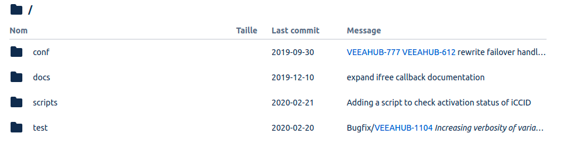

# Git Workflow
As a software system is evolving, it's useful to be able to understand how this evolution is happening, especially if it's being carried out by more than one instigator.

This document describes best practices; a bit of explanation behind the choices; as well as practical tools and tips for adherence. It's assumed that readers are already familiar with [Git](https://git-scm.com/doc), such that they could vaguely describe most of the commands. The practices discussed will be mostly generalisable to other version control systems.

## Extracting Value from Commits
A legible history is not just useful for managing merge commits − it can also provide insight for project managers; for your fellow programmers; and for your robotic assistants:
* How many lines of code were committed each day? ([Hercules](https://github.com/src-d/hercules))
* How much impact was made from each commit? Which people are making the most impact? ([Gitprime](https://blog.gitprime.com/impact-a-better-way-to-measure-codebase-change/))
* Which commits introduced bugs? Which recent commits follow this pattern and seem like they might be new bugs? ([Gitrisky](https://medium.com/civis-analytics/predicting-code-bug-risk-with-git-metadata-bc0b675ad28f))

If you're trying to implement a feature similar to some existing functionality, sure you can try to copy bits of it, but how does it all fit together? This can be especially tricky in the presence of [dependency injection](https://en.wikipedia.org/wiki/Dependency_injection). If you have a succinct, comprehensible commit message like `Adding autocompletion to the wine detail page`, then you can revisit that commit later, seeing all the changes that needed to be made to support this behaviour.

A good way to find pertinent commits is to use [`git blame`](https://git-scm.com/docs/git-blame), typically available in IDEs with a less combative name, like "[annotate](https://www.jetbrains.com/help/idea/investigate-changes.html)" (JetBrains).


Going further, let's consider a detailed commit like [this one in Linux](https://github.com/torvalds/linux/commit/6e88abb862898f55d083071e4423000983dcfe63). It doesn't just say what changed; it discusses in prose why it's happening, going so far as to teach the reader. It even includes references.

## Embedding Value in Commits

Like any other stream of engineering, our decisions are best when they're documented. It's not just for auditing, it's to allow ourselves to get into a repeatable process; and because dependencies will inevitably change − maybe we'll end up having access to an [optical computer](https://en.wikipedia.org/wiki/Optical_computing), a [quantum computer](https://en.wikipedia.org/wiki/Quantum_computing) or just a cheaper cloud host.

So at the opposite end of the spectrum to the discussion-piece commit, some common patterns are:
* `Fixing a bug` / `Quick fix` − if we encounter this in the log (or equivalently, the [History page](https://help.github.com/en/desktop/contributing-to-projects/viewing-the-branch-history) of GitHub), then it's going to be meaningless, because we don't know which file changed − the bug could've been anywhere. If we encounter it in a file view (`git blame`), it's more useful, but even then, it gives us a false sense of security − this line must apparently be bug-free! What if there were multiple bugs?

  [What counts as a bug anyway?](https://www.quora.com/Can-you-explain-in-simple-terms-what-a-software-bug-is) Abstractly, it's a mismatch between real vs expected results, but who's to say it's the software's fault that there's a mismatch? The code and the commit history are intended for engineers, not for philosophers − please say which bug you fixed; and ideally, where it was.

* [`Improving code`](https://github.com/django/django/commit/058b38b43ea4726be2914ecc967b8fb1da47d995#diff-e3e2a9bfd88566b05001b02a3f51d286) − like other streams of engineering, there are often trade-offs to any decision. It's rarely clear-cut that one piece of code is *fundamentally better* than something else. Besides, aren't all commits meant to improve the codebase? If your commit vocabulary includes `making things better`, do you balance out the excitement with some commits `making things worse`?

* `Revising as per business requirements` / `Adjusting as per feedback` − commit messages are meant to explain what's happening. What are the business requirements? What was the feedback? If the explanation needs its own explanation, then where does it end?

  

  In the same vein is commits like `Revised widget controller as per JIRA-1257`. Sure, there's probably more information in Jira, but even if [you've configured hyperlinks from your repository to Jira issues](https://stackoverflow.com/a/58383541/1495729), a few words reminding readers about the purpose of `JIRA-1247` will go a long way in helping them to stay in the flow; and it will protect against spelling mistakes in codes, that could easily go unnoticed.

  

## Synchronising History
The most valuable aspect of version control is arguably its ability to manage divergent paths, bringing them back in sync so that the codebase can be advanced by a team rather than just a lone wolf.

The popular ways of doing this are variations of `git merge` vs `git rebase`. *Merging* tries to interleave the history from both branches, then at the end, if there were any merge conflicts, there'll be a prompt to create a *merge commit*.

The merge commit isn't ideal, as it strips code of its real provenance. If you look at `git blame`, you'll see that some lines didn't originate because of this feature or that feature − they arose because `Resolving merge conflicts`.

One aspect of merging that's perhaps considered beneficial is its preservation of calendar history − the interleaving of the branches allows us to clearly see when each commit happened, but still, it's a false history − who's to say that the commits would've indeed happened this way, had the branches already been merged together? The surrounding code would've inevitably influenced each contributor's decisions, but by interleaving the commits, it's now unclear what the true context looked like.

Merging branches preserves the history of people's timesheets, at the expense of being able to see the history of features evolving. [Daily Turing](https://frontend.turing.io/lessons/module-2/merge-vs-rebase.html?ads_cmpid=6451354298&ads_adid=76255849919&ads_matchtype=b&ads_network=g&ads_creative=378026856672&utm_term=&ads_targetid=dsa-416714872696&utm_campaign=&utm_source=adwords&utm_medium=ppc&ttv=2&gclid=Cj0KCQiA-bjyBRCcARIsAFboWg2sjj63NVQhJ3DILxifvCxcYLL-voud0wJ_I-vQHuV5hbvrbkTe77AaAlK1EALw_wcB) offers this useful example of merging branches:


A further detriment of merging is that it
destroys the ability to roll back code. What if we deploy to production, then a few days later, notice that there was a bug? How do we roll back? Are we supposed to pick out this commit here and that commit there? How do we even know which ones were in each branch? For this kind of tricky situation, you might be stuck having to rely on [reflog](https://stackoverflow.com/questions/17857723/whats-the-difference-between-git-reflog-and-log) − your collection of commits that ever existed locally (this isn't propagated to your repository).

**Rebasing** branches means that your current branch's commits will be applied after some other branch − it will have a new base for its existence. A typical workflow will look like this:

```shell script
git checkout master
git pull
git checkout -b widget
…
git add widget.py
git add test/test_widget.py
git add README.md
git commit -m "Introducing widget (JIRA-580), for measuring metaphysical potential ⚗"

echo "We better get all the changes that have been done in the meantime…"
git checkout master
git pull
>>>remote: Enumerating objects: 24, done.
>>>remote: Counting objects: 100% (24/24), done.
>>>remote: Compressing objects: 100% (16/16), done.
>>>remote: Total 24 (delta 10), reused 18 (delta 8), pack-reused 0
>>>Updating 8bec076..0e939ad
>>>Fast-forward

git checkout widget
git rebase master
echo "Now all the changes in our branch have been moved to begin after master"
```
If you're working in a repository belonging to your company, an open-source project, or generally, a repository belonging to *someone else*, the typical flow would now typically involve [creating a pull request](https://git-scm.com/book/en/v2/GitHub-Contributing-to-a-Project):
```shell script
git push --set-upstream origin widget
>>> Visit https://github.com/…/widget to open a pull request
```
If it's your own repository, it'd be simpler to run:
```shell script
git checkout master
git merge master
>>> Fast-forwarding…
```

Notice that like merging, this history is also reinvented − we're saying that *widget* was written when there was this other code there, which there wasn't. The date is still preserved though, even if it's not actually used for ordering anything. So if you look at `git blame`, you'll see that the commit is still associated with the date it was written.

An exception to that date is when someone else does the merging:


Notice too that whenever merging and rebasing is done by someone else, the [*Verified* badge](https://help.github.com/en/github/authenticating-to-github/managing-commit-signature-verification) inevitably disappears. So not only does the verification help to prove your identity, it helps to catch errors in synchronising history − if you haven't already, **make sure to generate a GPG key and start verifying your commits!***

## Common Traps
### Revised History
While you were on your *widget* branch, maybe master didn't go forward − maybe its `HEAD` was rewritten or even reverted, perhaps due to a [force push](https://evilmartians.com/chronicles/git-push---force-and-how-to-deal-with-it). The history might not have gone forward in master, while you were gone.

In this case, you can rebase interactively (`git rebase --interactive master`). You'll get a choice about which commits you want; which will include all differences in your branch, even the ones that you didn't write (the ones that you had been relying on as your base). If you think that the new `master` still has much the same functionality as when you originally used it as a base, you can `drop` those outdated base commits that are lingering in your `widget` branch; and `pick` all of your commits that were actually relevant to implementing your widget.

## Someone Merges / Rebases A Commit Incorrectly
If you need to reinstate a commit, it'll be tempting for you to write a revision yourself and push it, with a commit message like `reinstating the thing`. Just like the *merge commit*, this mucks the history for that line. You'll just end up creating more confusion, guaranteeing an even more difficult scenario next time any merging / rebasing has to be done.

Instead, you can [cherry-pick](https://git-scm.com/docs/git-cherry-pick) the commit that was meant to be the last for that line (but which was merged incorrectly). Edit everything to be in the state that you want for `HEAD`; and it'll now show in the history that this line originated because of that (unverified) original commit (being replayed), as opposed to `reinstating the thing`.

## Protecting Your Commits
In order to preserve your commits with the functionality you intended, there are some practical habits:
* Avoid blank lines within functions. Git only considers a small window around changes, so if conflicting changes both involve a blank line above them or below them, you'll end up in a scenario where one function is starting within another function and it's a nightmare to resolve.

  Besides avoiding the blank lines, you can also get into the habit of [writing Javadocs](https://www.jetbrains.com/help/idea/working-with-code-documentation.html). This will mean that everything has more context to it, and the ends of functions are kept in tact.

* Update the documentation for your changes, in the same commit. Your repository can hold rich documentation in the form of [Markdown](https://guides.github.com/features/mastering-markdown/) and [PlantUML](https://plugins.jetbrains.com/plugin/7017-plantuml-integration). If anything is being refactored, your IDE will consider these in its search, as opposed to what happens if it's kept in eg Confluence − it goes stale, nobody knows that it's going stale, then it gets abandoned because it becomes easier to start again rather than updating it.

* Include unit tests in your commits. While resolving a merge / rebase conflict, you'll need to keep pausing to resolve each commit. The code is meant to be valid at each stop, such that you can run the code, including tests. Make the most of this and help the merger to ensure that the codebase stays true to your commit.

## Tools
Git can try to render a more visual representation of a project's history, with a fair few formatting parameters that wind up being impossible to remember, so once you've settled on something appealing to you, it's best to create an alias for it (credit to [Captain Lepton](https://superuser.com/a/828874)):
```shell script
git config --global alias.visualize "log --all --color --graph --pretty=format:'%Cred%h%Creset -%C(yellow)%d%Creset %s %Cgreen(%cr) %C(bold blue)<%an>%Creset' --abbrev-commit"
echo "Now I can visualise repositories easily…"
git visualize
```
